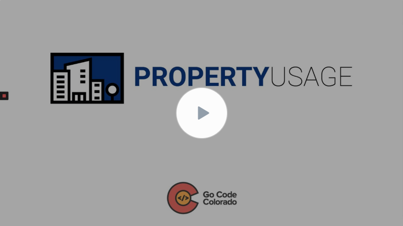
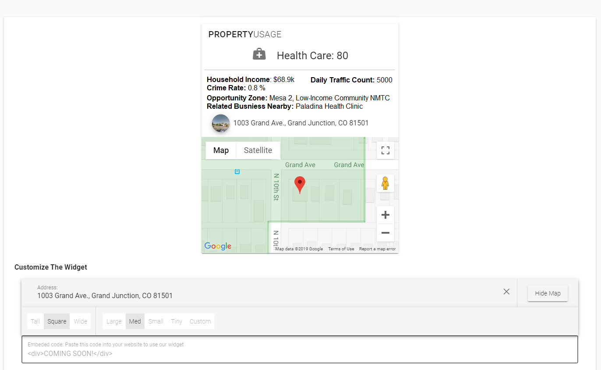
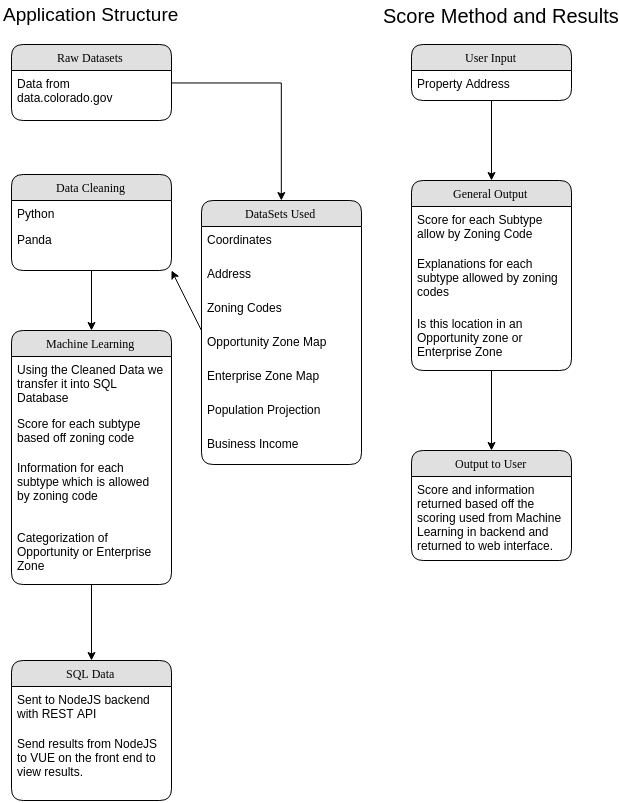

## 
# Property Usage API

Commercial Real Estate Development Analytics

PropertyUsage will recommend possible uses for a commercial property and show the data behind the recommendation.

### Links

To get started visit please the [Contribution Guide](./docs/CONTRIBUTING.md)

The machine learning details can be found [here.](./python/MachineLearningMethod.md)

The REST API documentation is found [here.](./docs/API%20Documentation.md)

### Presentation

[Google Slides](https://docs.google.com/presentation/d/1RyRSOuuU0etUdsxI1YwUsCmR6EtxfcEucp0pZHNJ-Zc/edit?usp=sharing)

[Loom Slideshow Presentation](https://www.loom.com/share/db106dbadc7f43e9a91f4af8d2c9ecd9)
[](https://www.loom.com/share/db106dbadc7f43e9a91f4af8d2c9ecd9)


### Info

Data and recommendations are available through a simple RESTful API interface on our website that can also be integration into other custom applications. We also offer an embeddable widget which allows quick integration on property listing pages and websites.



In our MVP we currently only support limited usage types and Mesa County addresses due to zoning data, that needs to be aggregated.

We have a live development server running at [beta.propertyusage.com](http://propertyusage.com) for internal testing.



Running ```npm start``` from root directory will install all dependencies, build the client, and launch the server.

### Datasets

**CIM:**
- Business Entities
- Population Projections
- Enterprise Zones
- Opportunity Zone
- Crime in Colorado from 1997 to 2015
- Degrees by Institution
- Personal Income
- Road Traffic Counts 2014-2017
- Highway Traffic Counts 2014-2017
- All Restaurants in Colorado

**GIS:**
- Mesa County zoning

**Better Business Bureau**
- OpenAddresses for Mesa

<p align="center">
  
</p>
